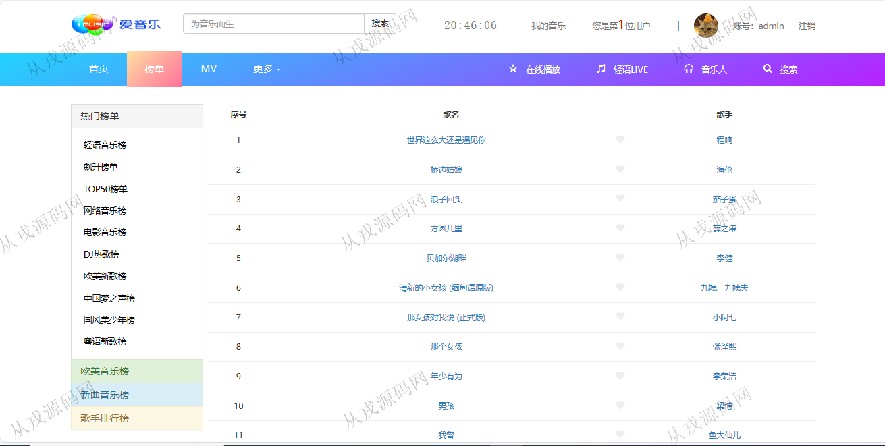
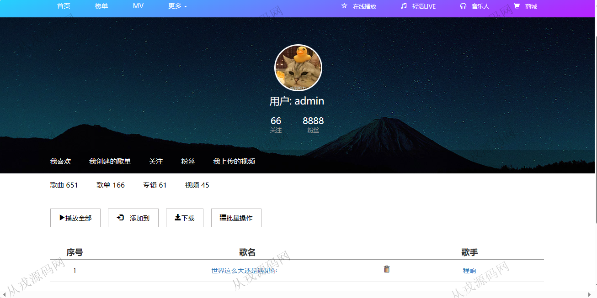
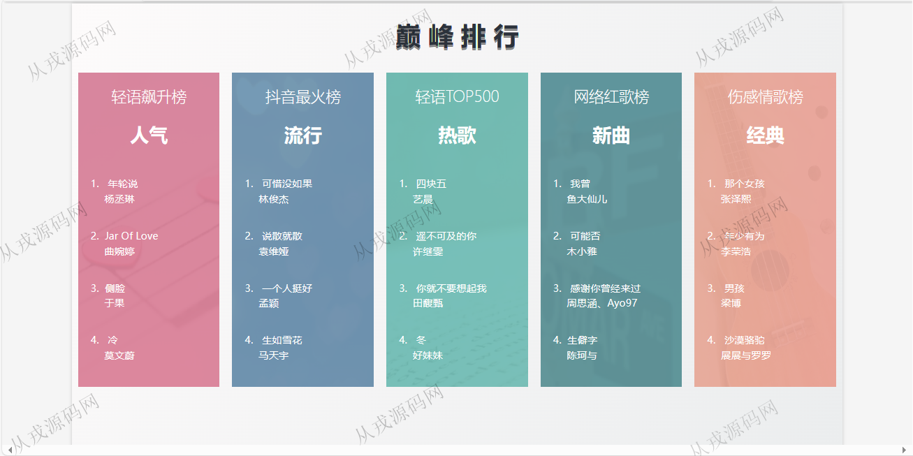

<h1 align="center">210.音乐管理系统</h1>

 获取sql文件 QQ: 386869957 QQ群: 377586148 

 [更多源码项目: 从戎源码网](https://armycodes.com/) 

## 简介

> 本代码来源于网络,仅供学习参考使用!
>
> 提供1.远程部署/2.修改代码/3.设计文档指导/4.框架代码讲解等服务
>
> http://localhost:8082/
> 
> user 123456
>

## 项目介绍
基于springboot的音乐管理系统：前端 html、jquery、bootstrap，后端 maven、springmvc、spring、mybatis；角色分为管理员、用户；集成音乐在线播放、收藏、音乐搜索等功能于一体的系统。

## 功能介绍

- 基本功能：登录，注册，退出，密码修改
- 网站首页：主导航栏，全局搜索，轮播图，歌单推荐，巅峰排行
- 在线播放：音乐列表，音乐详情，播放，暂停
- 我的音乐：收藏音乐列表，收藏取消

## 环境

- <b>IntelliJ IDEA 2021.3</b>

- <b>Mysql 5.7.26</b>

- <b>JDK 1.8</b>

## 运行截图

